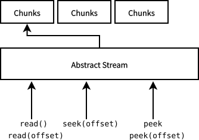

# ZeroMux Bundle
ZeroMux is a file sharing toolkit and site builder for [ZeroNet](https://zeronet.io). ZeroMux is the software that will make ZeroNet into a file sharing and media streaming network. It pushes ZeroNet's limit of handling big files by breaking big files into small chunks. Video files are converted into streaming friendly format and piped into HTML media elements, using [Media Source Extensions API](https://developer.mozilla.org/en-US/docs/Web/API/Media_Source_Extensions_API) and a built-in MP4 multiplexer.

## Getting Started
1. Download this repo, or if you prefer, get the pack at [ZeroMux Blog on ZeroNet](http://127.0.0.1:43110/1CiDoBP8RiWziqiBGEd8tQMy66A6fmnw2V/big/bundle/)
2. Unpack and run `wizard.py`
3. After you made changes to your file list, put the `loader` folder onto your site.
4. Sign and publish. Tell your friends to come visit your site.
5. For instructions of how to configure your ZeroNet site, refer to [ZeroMux Docs on ZeroNet](http://127.0.0.1:43110/1CiDoBP8RiWziqiBGEd8tQMy66A6fmnw2V/big/docs/gentle-intro/) and read more about it.

## Reminders
Because of how ZeroNet works, every file on your site is **public**, which means that everyone can see your files. You should never use ZeroMux as a personal data backup software. ZeroMux will not encrypt any data for you.

You should never rely on ZeroMux to keep your data permanent. Although ZeroMux will not damage your files, there is no guarantee that every part of your files is distributed to fast and reliable peers.

ZeroMux does not strip metadata.

## Ways to Help
You can make ZeroMux project better by simply:
- Testing ZeroMux on your computer, and suggesting ways to improve. [File an Issue](https://github.com/MuxZeroNet/ZeroMux/issues)
- Talking to me [privately](http://127.0.0.1:43110/1CiDoBP8RiWziqiBGEd8tQMy66A6fmnw2V/big/docs/about/) about your experience.

There are a lot of features that are not easy to use, not finished and not implemented. I will be very pleased if you can:
- Draw a diagram of how to implement an abstraction layer between **chunks** and **bytes**, so that a stream interface can be made. You can [file an issue](https://github.com/MuxZeroNet/ZeroMux/issues).
- Think of ways to improve the [Python backend](wizard.py).
- Make a logo for ZeroMux.

You can also help the ZeroNet community by seeding the files you like from some [file sharing Zites](http://127.0.0.1:43110/1CiDoBP8RiWziqiBGEd8tQMy66A6fmnw2V/big/docs/about/demos/).

You can help us test [I2P support](https://github.com/HelloZeroNet/ZeroNet/issues/45), so that we can have even more seeders in the future.

You can help us persuade Chromium developers that [blocking `blob:null/` in an iframe sandbox](https://github.com/HelloZeroNet/ZeroNet/issues/707) should be considered as a bug, not a feature.

You can donate to [ZeroNet](https://github.com/HelloZeroNet/ZeroNet) and help keep both projects alive.

